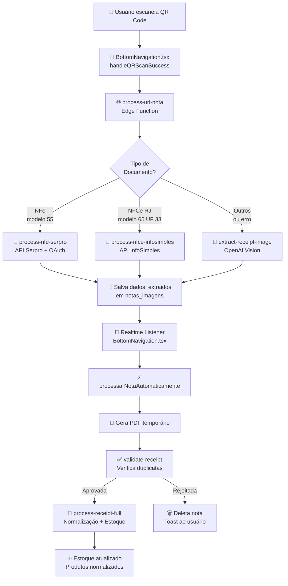

# 🔄 Fluxo Automático de Processamento de Notas Fiscais

## Visão Geral

O sistema implementa um **fluxo 100% automático** para processamento de notas fiscais após o scan do QR Code. Não há confirmação manual do usuário em nenhuma etapa.

## Pipeline Completo



## Detalhamento das Etapas

### 1️⃣ Scan do QR Code
**Arquivo**: `src/components/BottomNavigation.tsx` - `handleQRScanSuccess()`

- Usuário escaneia QR Code da nota fiscal
- Valida autenticação do usuário
- Detecta tipo de documento (NFe vs NFCe)
- Extrai chave de acesso (44 dígitos)
- Chama `process-url-nota`

### 2️⃣ Roteamento Inteligente
**Arquivo**: `supabase/functions/process-url-nota/index.ts`

Cria registro em `notas_imagens` e roteia para:

- **NFe (modelo 55)** → `process-nfe-serpro`
- **NFCe RJ (modelo 65, UF 33)** → `process-nfce-infosimples`
- **Outros casos** → `extract-receipt-image` (fallback OpenAI)

### 3️⃣ Extração de Dados

#### 📄 NFe - Serpro
**Arquivo**: `supabase/functions/process-nfe-serpro/index.ts`

- Consulta API oficial da Serpro
- OAuth 2.0 automático
- Cache persistente (`nfe_cache_serpro`)
- Normaliza estabelecimento via RPC
- Salva em `dados_extraidos`

#### 🎫 NFCe RJ - InfoSimples
**Arquivo**: `supabase/functions/process-nfce-infosimples/index.ts`

- Consulta API InfoSimples (R$ 0,24)
- Cache persistente (`nfce_cache_infosimples`)
- Categorização automática de produtos
- Normaliza estabelecimento via RPC
- Salva em `dados_extraidos`

#### 🤖 Fallback - OpenAI Vision
**Arquivo**: `supabase/functions/extract-receipt-image/index.ts`

- Baixa imagem do Supabase Storage
- Envia para OpenAI Vision API
- Extração inteligente de dados
- Normaliza estabelecimento via RPC
- Salva em `dados_extraidos`

### 4️⃣ Detecção Automática (Realtime)
**Arquivo**: `src/components/BottomNavigation.tsx` - `useEffect` realtime

```typescript
supabase
  .channel('notas_changes')
  .on('postgres_changes', {
    event: 'UPDATE',
    schema: 'public',
    table: 'notas_imagens',
    filter: `usuario_id=eq.${user.id}`
  }, (payload) => {
    // Detecta quando dados_extraidos é preenchido
    if (payload.new.dados_extraidos && !payload.new.processada) {
      processarNotaAutomaticamente(...)
    }
  })
```

### 5️⃣ Processamento Automático
**Arquivo**: `src/components/BottomNavigation.tsx` - `processarNotaAutomaticamente()`

1. **Gera PDF temporário** (necessário para validação)
2. **Valida nota** via `validate-receipt`:
   - Verifica duplicatas por chave de acesso
   - Verifica duplicatas por CNPJ + data + valor
3. **Se aprovada**:
   - Chama `process-receipt-full`
   - Normalização de produtos
   - Atualização de estoque
4. **Se rejeitada**:
   - Deleta registro
   - Toast com motivo da rejeição

### 6️⃣ Normalização e Estoque
**Arquivo**: `supabase/functions/process-receipt-full/index.ts`

1. **Normalização de Produtos**:
   - Busca em `produtos_master_global` (confiança ≥90%)
   - Se encontrado → produto normalizado
   - Se não encontrado → produto provisório
   
2. **Entrada no Estoque**:
   - Produtos normalizados: entram com `produto_master_id`
   - Produtos provisórios: entram com `produto_candidato_id`
   
3. **Sistema de Normalização Manual**:
   - Aprovação via `src/pages/admin/NormalizacaoGlobal.tsx`
   - Atualiza retroativamente produtos provisórios no estoque

## ⚠️ Pontos Críticos

### Não Há Confirmação Manual
- Todo o processo é **100% automático**
- O usuário apenas escaneia o QR Code
- Não há tela de confirmação de dados

### Validação de Duplicatas
- Feita automaticamente por `validate-receipt`
- Critérios:
  1. Chave de acesso duplicada
  2. CNPJ + Data + Valor duplicado (±R$0,50)

### Cache Inteligente
- **NFe**: Cache em `nfe_cache_serpro` (economia de créditos Serpro)
- **NFCe**: Cache em `nfce_cache_infosimples` (economia de R$ 0,24/consulta)

### Produtos Provisórios
- Produtos sem match (confiança <90%) entram como provisórios
- Indicador visual "⏳" na tela de estoque
- Aprovação manual atualiza automaticamente o estoque

## 📊 Estados da Nota

| Campo | Valor | Significado |
|-------|-------|-------------|
| `dados_extraidos` | `null` | Aguardando extração |
| `dados_extraidos` | `{...}` | Dados extraídos, aguardando validação |
| `processada` | `false` | Aguardando processamento |
| `processada` | `true` | Estoque atualizado |
| `normalizada` | `false` | Produtos não normalizados |
| `normalizada` | `true` | Todos produtos normalizados |

## 🔍 Debugging

### Logs importantes:
```typescript
// BottomNavigation.tsx
console.log('🔍 Tipo de documento:', tipoDocumento)
console.log('🤖 [AUTO] Iniciando processamento automático da nota:', notaId)

// process-url-nota
console.log('🌐 Processando URL da nota:', { userId, url, tipoDocumento })

// process-nfe-serpro
console.log('📄 [NFE] Consultando Serpro:', chaveNFe)

// process-nfce-infosimples
console.log('🎫 [NFCE] Consultando InfoSimples:', chaveAcesso)

// process-receipt-full
console.log('✅ [ESTOQUE] Salvando no estoque:', produto.nome)
```

### Verificar em Supabase:
1. **notas_imagens**: Status do processamento
2. **estoque_app**: Produtos inseridos
3. **produtos_candidatos_normalizacao**: Produtos pendentes
4. **nfe_cache_serpro / nfce_cache_infosimples**: Cache de consultas

## 🚀 Performance

- **Cache Hit**: ~100ms (sem custo)
- **API Serpro**: ~2-3s (sem custo adicional)
- **API InfoSimples**: ~2-4s (R$ 0,24)
- **OpenAI Vision**: ~3-5s (custo variável)
- **Processamento Total**: ~5-10s do scan até estoque atualizado

## 🔐 Segurança

- Todas as APIs usam autenticação via edge functions
- API keys não expostas no frontend
- RLS habilitado em todas as tabelas
- Validação de `user_id` em todas as operações
